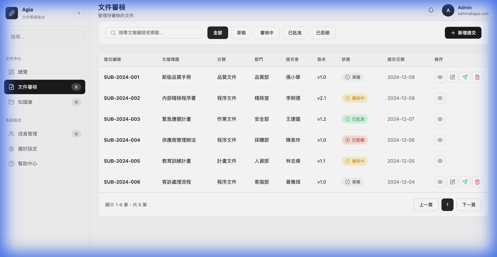
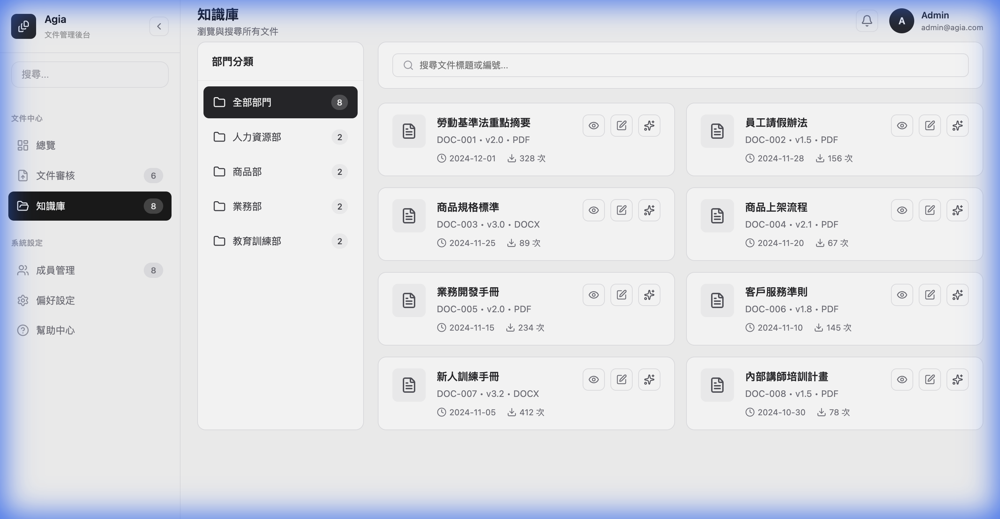
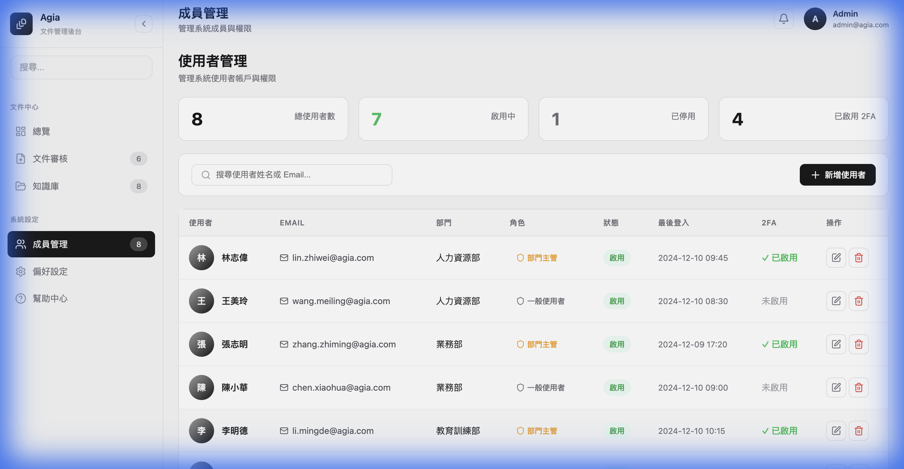

# Agia 文件管理後台 - 功能說明文件

本文件說明 Agia 文件管理後台的三個主要功能模組：**文件審核**、**知識庫**、**成員管理**。

---

## 一、文件審核



### 功能概述
文件審核模組用於管理文件的提交與審核流程，從草稿建立到最終批准或拒絕。

### 主要功能

| 功能 | 說明 |
|------|------|
| **狀態篩選** | 可依「全部」、「草稿」、「審核中」、「已批准」、「已拒絕」快速篩選文件 |
| **搜尋功能** | 輸入文檔編號或標題進行即時搜尋 |
| **新增提交** | 點擊右上角按鈕建立新的文件提交 |
| **查看詳情** | 點擊 👁️ 圖示可查看文件完整內容 |
| **編輯文件** | 草稿狀態下可點擊 ✏️ 圖示編輯 |
| **送審** | 點擊 ➤ 圖示將草稿送出審核 |
| **審核操作** | 審核中的文件可進行「批准」或「拒絕」 |

### 文件狀態流程

```
草稿 → 審核中 → 已批准 / 已拒絕
```

### 操作說明

1. **建立新文件**：點擊「新增提交」→ 填寫標題、分類、部門、內容 → 儲存
2. **送審文件**：在草稿列表中點擊 ➤ 圖示，文件狀態將變更為「審核中」
3. **審核文件**：點擊查看審核中的文件 → 選擇「批准」或「拒絕」

---

## 二、知識庫



### 功能概述
知識庫模組是企業文件的集中存放處，支援分類瀏覽、搜尋、編輯及 AI 處理預覽功能。

### 主要功能

| 功能 | 說明 |
|------|------|
| **部門分類** | 左側可依部門篩選文件（人力資源部、商品部、業務部、教育訓練部） |
| **搜尋功能** | 可依文件標題或編號搜尋 |
| **查看文件** | 點擊 👁️ 圖示以 Markdown 格式查看文件內容 |
| **編輯文件** | 點擊 ✏️ 圖示開啟 Markdown 編輯器 |
| **AI 處理預覽** | 點擊 ✨ 圖示預覽 AI 斷詞切割結果 |

### Markdown 編輯器功能

編輯器提供完整的 Markdown 工具列：

- **格式化**：標題(H1/H2)、粗體、斜體
- **列表**：項目清單、編號清單
- **其他**：引用、程式碼、連結
- **歷史**：上一步/下一步（Undo/Redo）
- **即時預覽**：可開關右側預覽面板

### AI 處理預覽功能

此功能可模擬 AI 對文件進行斷詞處理，產出知識圖譜所需的 JSON 格式：

- **左側**：顯示擷取的條款列表，可展開查看 AI 判斷的概念與關鍵字
- **右側**：顯示 JSON 輸出格式，可複製使用

**JSON 輸出欄位說明**：

| 欄位 | 說明 |
|------|------|
| `id` | 條款唯一識別碼 |
| `clause_number` | 條款編號 |
| `title` | 條款標題 |
| `content` | 條款內容摘要 |
| `metadata` | 來源文件、部門、分類、版本等資訊 |
| `ai_analysis` | AI 分析結果（概念、關鍵字、重要性） |

---

## 三、成員管理



### 功能概述
成員管理模組用於管理系統使用者帳戶，包括角色分配、狀態控制及安全設定。

### 主要功能

| 功能 | 說明 |
|------|------|
| **統計總覽** | 顯示總使用者數、啟用中、已停用、已啟用 2FA 數量 |
| **搜尋功能** | 可依姓名或 Email 搜尋使用者 |
| **新增使用者** | 點擊右上角按鈕新增成員 |
| **編輯使用者** | 點擊 ✏️ 圖示編輯使用者資料 |
| **刪除使用者** | 點擊 🗑️ 圖示刪除使用者 |

### 使用者資訊欄位

| 欄位 | 說明 |
|------|------|
| **使用者** | 姓名與頭像 |
| **Email** | 電子郵件信箱 |
| **部門** | 所屬部門（人力資源部、業務部、教育訓練部、商品部） |
| **角色** | 部門主管 / 一般使用者 |
| **狀態** | 啟用 / 停用 |
| **最後登入** | 最後登入時間 |
| **2FA** | 雙因素驗證狀態 |

### 角色權限

| 角色 | 權限說明 |
|------|----------|
| 部門主管 | 可管理部門內文件與成員 |
| 一般使用者 | 可瀏覽與編輯指定文件 |

---

## 共用導航功能

### 側邊欄
- **可收合/展開**：點擊右上角箭頭按鈕
- **數字徽章**：顯示各模組的項目數量
- **活動狀態**：當前頁面以深色圓角背景標示

### 頂部導航
- **頁面標題**：顯示當前頁面名稱與說明
- **使用者資訊**：右上角顯示登入者資訊
- **通知鈴鐺**：系統通知入口

---

## 技術規格

- **前端框架**：React + Vite
- **路由**：React Router DOM
- **圖示**：Lucide React
- **Markdown**：React Markdown + remark-gfm
- **樣式**：Vanilla CSS + CSS Variables

---

*文件最後更新：2024-12-10*
